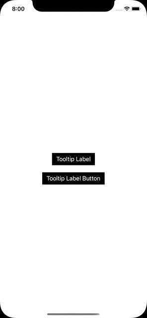

# UsefulSwiftFile
A Collection of Useful Swift Files

## Logger.swift 
This is an Swift File to create logger with given below level and on console it shows with unicode character to easily recognised and helpful at debugging
```
verbose  return "➡️"
debug    return "❓"
info     return "ℹ️"
warning  return "⚠️"
error    return "❌"
```


## ToolTip
Into this we used Popover ```UIPopoverPresentationController``` to present Tooltip into Button Clicks, here we can implement into any other view and also customize design according to xib user inferface, find complete source code into ToolTipDemo App
###### &nbsp;
<kbd>

</kbd>
&nbsp; &nbsp; &nbsp; &nbsp;
